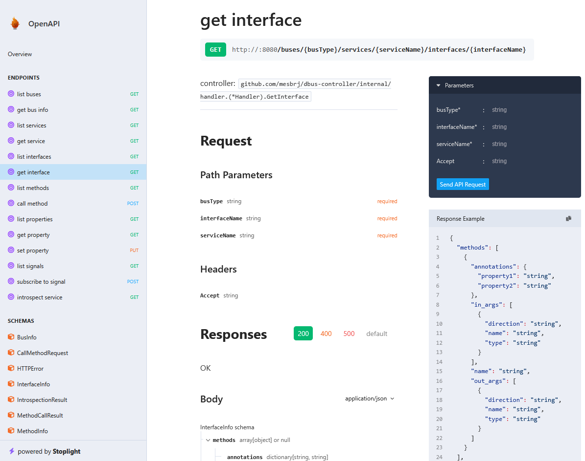

# D-Bus Controller

A REST API server for introspecting and controlling the Linux D-Bus system.

## Features

- **REST API**: Clean, RESTful interface for D-Bus operations
- **System & Session Bus Support**: Access both system and session D-Bus buses
- **Real-time Introspection**: Dynamic discovery of services, interfaces, methods, properties, and signals
- **Method Execution**: Call D-Bus methods via HTTP POST requests
- **Property Management**: Get and set D-Bus properties via REST endpoints
- **Signal Monitoring**: Subscribe to D-Bus signals (work in progress)
- **No Persistence**: All data is introspected at runtime for real-time accuracy
- **OpenAPI Documentation**: Auto-generated API documentation via Fuego
>
- **Framework Web**: **[Go Fuego](https://github.com/go-fuego/fuego)**
- **D-Bus Library**: **[godbus](https://github.com/godbus/dbus)**

## API Overview
**Swagger UI**: `http://<host_or_pod>:8080/swagger/index.html`
**OpenAPI**: `http://<host_or_pod>:8080/swagger/openapi.json`

## Run on Podman and Kubernetes

Isolated session bus dedicated to the POD, with no access to the system or host, and without requiring elevated privileges (eliminating related security risks). Only containers within the same POD that share the same user and volume (unix_socket/bus) can access this session bus.

Each container in the POD must implement its own D-Bus interfaces related to its application or service workload. Only these interfaces are exposed through the REST API.

Docker can be used instead of Podman, but Podman is preferred for its POD support.

Simple *hello world "dbus app"* example [here](./examples/dbus-apps/dbus_hello_world/README.md) include deployment manifests for Podman (tested) and Kubernetes (need testing).

## Run on VMs, physical computers and single-board-computers (x86-64, ARM-arch32-64 platforms)

The D-Bus (software and libraries from **freedesktop.org**) works in Unix and Linux systems apart from the init system (Systemd, SysV, OpenRC, BSD rc, etc). In this scenario, the D-Bus Controller can be run as a service or application that connects to the system and session buses of the host system.
